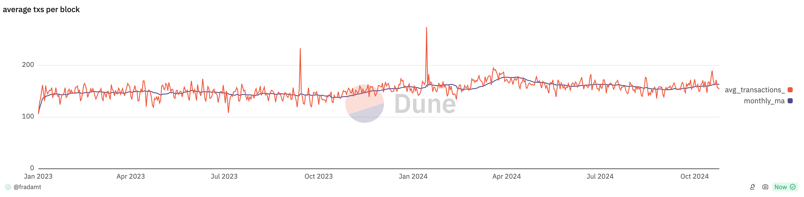

*Thanks to Thomas, Toni, Barnabe, @lighclient, Ansgar and the other FOCIL authors for comments and discussion*.

At slot N, IL committee members choose transactions to include in their ILs, affecting the payload of slot N+1. They do so based on some local rules, out of the valid and basefee-paying ones in their mempool.  Crucially, validity is with respect to a state, for example the head state that an IL committee member has at the time of building its IL. There are two similar ways in which a transactions that looks valid might end up being invalid, so that space for it in the IL is wasted:

1. **Ex-ante invalidation**: The head state of the IL committee member might not be based on the latest payload, for example because the timing of the payload release is such that it is not always possible to see and execute the payload before releasing an IL. Concretely, the IL could be based on the payload of slot N-1, but a transaction in the IL could be invalidated in the payload of slot N.
2. **Ex-post invalidation**: Payload N+1 is built in such a way that the IL transaction becomes invalidated should it be appended to the payload (e.g., a distinct transaction from the same sender with the same nonce is included in payload N+1, and the IL transaction can no longer be validly included).

Though they are in a way quite similar, let's consider the two situations separately.

## Ex-ante invalidation

Here, part of the issue is that degrading an IL's quality (wasting space in it) does not even require a targeted attack: an IL committee member that has not yet executed the payload of slot N-1 might just include all transactions in that payload in its IL, simply because it does not know that they have already been included in a block. This problem would be much worse if we explicitly designed the IL construction to be based on the state of slot N-1 instead of slot N. This would be the case if, for example, we wanted to relax the timelines of the IL mechanism, stretching them out throughout the whole slot instead of being compressed at the end of the slot because of having to wait for the payload reveal.

Thankfully, the solution to this problem is relatively simple: ILs should have enough space to include transactions for two blocks, so that even including *all* txs from the previous payload still leaves space for enough txs to fill a whole other payload. One caveat here is that the relevant resource for ILs is bytes, while for blocks it is gas. Moreover, we certainly cannot set the size limit of ILs such that they can fit worst-case blocks (currently ~1.8 MBs), even in aggregate across all 16 ILs.  On the other hand, the median tx is around 200 bytes, so an IL with a 16 KBs limit can include around 80 such txs, and collectively 16 ILs can include ~1280.

The [average amount of txs per block](https://dune.com/queries/4200907/7070535) has been quite stably between 140 and 160 for a while, so 1280 suffices for 8 target blocks (15M gas), or 4 full blocks. There would of course be overlaps between the ILs, and we also don't want to assume that all IL committee members are honestly filling them, but that still leaves us quite a bit of leeway.

## Ex-post invalidation

Here we are not so much concerned with accidental invalidation, and rather with a specific attack from the proposer of slot N+1. Since it has full control over the payload of its slot (it can decide not to outsource it), it can do the following with very little risk:

1. After the payload of slot N has already been committed, it floods the mempool with its own transactions, many of which will end up taking space in the ILs from slot N
2. In slot N+1, it proposes a payload which invalidates all of these transactions

### Pre EIP-7702

If we were to consider the way transaction invalidation works today, this would not be an attack at all, *as long as all IL inclusion rules follow the very simple principle of only including no more than one transaction per EOA*: this way, each tx in the payload of slot N+1 can at most invalidate a single tx in each IL (without this rule, an IL could contain multiple txs from one EOA and a single tx from that EOA could invalidate all of them by draining its balance). In other words, each tx in the payload only takes up "one IL slot" (possibly in more than one IL, but that's normal redundancy that we are ok with), which is fine since it is actually paying for execution.

### With EIP-7702

EIP-7702 complicates the situation somewhat, because delegation breaks the invariant that an EOA's balance can only change after execution of a tx from that same EOA. Due to this, a single tx can now invalidate many txs from different delegated EOAs, by removing their balance. Delegation and sweeping of the balances might even all happen in the same payload, or even within a single tx, so that we cannot just solve the problem by not including txs from delegated EOAs in the ILs (and even if we could, that would make such accounts less censorship resistant, which is far from ideal). Thankfully, while this mass invalidation can be done by a single tx, it still incurs a significant cost which is linear in the number of txs it invalidates. In fact, the cost *per invalidated tx* is at least 9000 gas, [the cost of a `CALL` with value](https://github.com/ethereum/execution-specs/blob/master/src/ethereum/cancun/vm/gas.py#L50), within a small constant factor of the 21000 gas minimum that it would take to invalidate a tx from a non-delegated EOA.

### With native AA

In any native AA approach, *the mempool* should have restrictions on which state can be touched by the validation step, to avoid mass invalidation problems, e.g., many txs all being invalidated by a single storage slot changing value. Since IL txs are chosen from the mempool, they inherit the same restrictions. In particular, let's focus on the approach which requires the validation step of a tx for account A to only touch the state of account A itself, so that invalidating a set of N txs from N different accounts would require changing the values of at least N different storage slots. Each invalidation would then require at least [5000 gas: 2100 to warm up the slot plus 2900 to change the value](https://www.evm.codes/?fork=cancun#55). Less than today or with EIP-7702, but still the same order of magnitude, and certainly a meaningful cost.

## Calldata-heavy transactions

In the discussion of ex-post invalidation, we are essentially arguing that invalidating IL txs in the next payload costs at least 9000 gas *per invalidated tx*. This seems ideal, because occupying "one IL slot" has a sufficiently high minimum cost. However, "one IL slot" is not a useful concept if ILs include full txs, rather than just tx hashes, because then the total amount of txs that can be included depends on how heavy they are: a single 16 KB tx could fully occupy a whole IL, but then be invalidated by a simple balance transfer taking 21000 gas, or even just 9000 gas if the account is delegated. Even without worrying about ex-post invalidation by a cheaper tx, 16 KB of calldata would only cost 256k gas, or the equivalent of 3-5 ERC-20 transfers, far from a huge cost for clogging up a whole IL. We have two possible solutions:

1. **Only include tx hashes**: including a tx would cost 32 bytes regardless of its calldata or gas limit or any other specifics of the tx, and ILs could always include a fixed amount of txs, for example 256, fitting within 8 KBs. The concept of IL slot is well defined here, and we can say that occupying an IL slot costs at least 9000 gas.
The tradeoff is that the propagation of an IL on the dedicated CL gossip topic would not by itself guarantee that it can be enforced, because the CL would have to first check availability of the full tx with the EL. If a node does not have a certain tx in its EL mempool, it would first have to request it. Still, this is arguably more efficient in the normal case, as there is no point in the CL gossiping txs that are already in the EL mempool (similar rationale to why [the `getBlobs` method](https://github.com/ethereum/execution-apis/pull/559) has been implemented). Moreover, it is quite safe even in the adversarial case, because inclusion of a tx is only enforced if a majority of attesters (and thus a very large amount of nodes in the network) either have it in their EL mempool or successfully manage to request it by the freeze deadline, in which case it is quite unlikely that the proposer or builder of the next slot does not manage to retrieve the tx even after a few extra seconds.
Finally, note that an IL mechanism that works for blob txs would almost certainly work in this way, so using tx hashes could either be a way to support blob txs from day 1, or a way to experiment with this kind of mechanism with regular txs, with the goal of eventually supporting blob txs as well (to be clear, doing so *with a sharded mempool* would likely require some other adjustments unique to blob txs).
2. **Include full txs and rely on local inclusion rules**: quite simply, *we do not need to include the 16 KB tx that clogs up the whole IL*, or at the very least we do not have to prioritize its inclusion, for example even if it were to come with a high priority fee. An extremely simple way to deal with the problem would be for an IL committee member to just order the valid txs in its local mempool by byte size, in ascending order, so as to maximize the number of txs that can be included. We could then refine this to first include all txs that have been in the mempool for a few slots and all the while valid and basefee-paying, to make sure that even calldata-heavy txs that have failed to be included for some time have a chance at IL (and then hopefully block) inclusion. We could even go further and remove the deterministic ordering part of the rule, which would tend to increase the overlap between ILs and generally decrease their collective effectiveness at covering the mempool. For example, an IL committee member could do the following:
    - Include all txs that have been includable for a while, according to some rule. Say that the remaining amount of space in the IL at this point is M bytes.
    - Starting with a set of includable txs (valid, basefee paying txs in the mempool), narrow it down to a set of candidate txs by (somehow) picking a single tx per EOA (according to the principle from the previous section). Say there are N candidate txs, and let T = M/N.
    - Go through the candidate txs (in some order), and include a candidate tx of size S bytes with probability $p(S) = \min(1, T/S)$, until either all txs have been included or there's no more space for any tx. In other words, transactions are included with probability inversely proportional to their size, and transactions smaller than T bytes, i.e., taking up less than 1/N of the available space, are always included.

With this inclusion rule, the expected number of bytes added by a tx of size S bytes in the candidate set is $p(S) \cdot S \leq T$. *Crucially, this upper bound does not depend on S*: heavy txs consume the same *expected* amount of resources as light txs. The total expected size added after going through the candidate set is then $\leq N\cdot T = M$, the amount of space we have available in the first place. This way, even calldata-heavy txs have a chance to sporadically get included (how sporadically is proportional to how many IL resources they consume), but spamming calldata-heavy txs (whether or not in the context of an ex-post invalidation attack) does not achieve the goal of crowding ILs  except with low probability.

What an adversary can do to affect the inclusion probability of "real" txs is mainly to increase N, by creating "fake" txs *from many EOAs*, because this lowers T and thus $p(S)$ as well. However, we are essentially back to having a meaningful concept of "IL slot" with an associated cost. Say there are N real candidate txs, and adversary has a budget of $9000\cdot$N' gas to spend, which it does by sending N' txs from N' different EOAs. Overall, there are then N+N' candidate txs. For most real txs, the IL is not yet full when they're considered for inclusion, because the expected total space is exactly M. Whenever that's the case, a real tx of size $S$ has probability of inclusion $p(S) = \frac{M}{S(N+N')}$, so the adversary essentially only succeeds in lowering the inclusion probability from $\frac{M}{S\cdot N}$ to $\frac{M}{S(N+N')}$, by a factor of $\frac{N+N'}{N}$. To lower $p(S)$ by a factor of $k$, the adversary has to spend the resources for $(k-1)\cdot N$ fake txs, just like it would in the protocol with tx hashes!